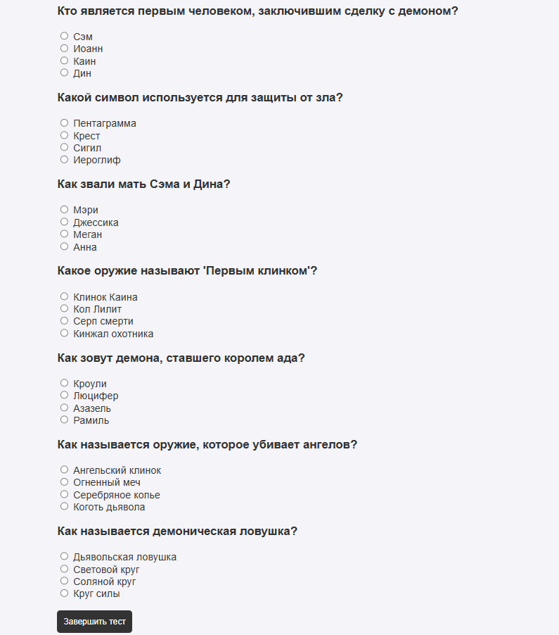

# Тестовое веб-приложение

## Описание
Это веб-приложение для прохождения тестов, где пользователи могут анонимно проходить тесты и получать результаты. Администратор может войти в систему и просматривать все результаты тестов. Приложение поддерживает создание тестов с вопросами с одним и несколькими правильными ответами.

## Инструкции по запуску

1. Скачайте или клонируйте репозиторий на ваш компьютер.
2. Перейдите в папку проекта, откройте `index.php`, чтобы начать тест.

## Краткое описание функционала

- **Пользователи**:
  - Могут пройти тест анонимно.
  - Получают количество правильных ответов и процент в конце теста.

- **Администраторы**:
  - Могут просматривать все результаты пользователей.
  - Могут удалять или редактировать результаты тестов.

## Структура файла данных

`questions.json` — хранит вопросы и ответы тестов:

```json
[
  {
    "question": "Как зовут главных героев сериала 'Сверхъестественное'?",
    "answers": [
      {"text": "Дин и Сэм", "correct": 1},
      {"text": "Джон и Джейк", "correct": 0},
      {"text": "Майк и Том", "correct": 0}
    ],
    "type": "single"
  },
  {
    "question": "Какие сверхъестественные существа встречаются в сериале?",
    "answers": [
      {"text": "Вампиры", "correct": 1},
      {"text": "Зомби", "correct": 1},
      {"text": "Гоблины", "correct": 0},
      {"text": "Демоны", "correct": 1}
    ],
    "type": "multiple"
  }
]


results.json — хранит результаты тестов: [ { "name": "Аноним", "correctCount": 2, "score": 66, "time": "10:20" } ]
 ### Главная страница Когда вы открываете приложение, на главной странице вы увидите следующие элементы интерфейса:

 1. **Кнопка "Пройти тест"**:
 - Если вы хотите пройти тест, достаточно нажать кнопку "Пройти тест". Вас перенаправит на страницу с вопросами теста, где вам нужно будет ответить на вопросы.
- На странице теста будет несколько вопросов с вариантами ответов. Вопросы могут быть двух типов: - **Один правильный ответ** — вы выбираете один правильный ответ из предложенных. - **Несколько правильных ответов** — вы выбираете несколько правильных ответов из предложенных.
2. **Кнопка "Администратор"**:
- Если вы являетесь администратором, вам нужно нажать кнопку "Администратор", чтобы ввести пароль и получить доступ к административной панели.
- После успешной авторизации, вы попадете на страницу административной панели, где сможете просматривать, редактировать и удалять результаты тестов.
 ### Страница прохождения теста На странице теста отображаются следующие элементы:
1. **Поле для ввода имени**:
- Первым делом вам предложат ввести ваше имя, чтобы результат был записан и ассоциирован с вами.
2. **Вопросы с ответами**:
 - После ввода имени вам будут предложены вопросы с вариантами ответов. Вопросы могут быть двух типов:
- **Один правильный ответ**:
 для такого вопроса используются радио-кнопки (`radio`), и вы выбираете один вариант ответа.
- **Несколько правильных ответов**: для таких вопросов используются флажки (`checkbox`), и вы можете выбрать несколько вариантов ответа.
 
3. **Кнопка "Завершить тест"**:
- После того как вы ответили на все вопросы, вы нажмете кнопку "Завершить тест", и система подсчитает количество правильных ответов и выведет ваш результат: количество правильных ответов и процент правильных ответов.
4. **Результаты теста**: -
 На странице результатов отображается количество правильных ответов, процент набранных баллов и время прохождения теста. 
 ### Административная панель (доступна только для администраторов)
 1. **Страница входа в административную панель**:
 - Для доступа к административной панели администратор должен войти, введя пароль.

2. **Просмотр результатов пользователей**:
- После успешной авторизации, администратор попадает на страницу, где может просматривать результаты тестов всех пользователей.
- В таблице отображаются следующие данные: - Имя пользователя. - Количество правильных ответов.
 - Процент набранных баллов.
- Время прохождения теста. 
3. **Редактирование и удаление результатов**:
   - Администратор может редактировать или удалять результаты тестов пользователей.
   - Для редактирования нажмите на кнопку "Редактировать", чтобы изменить количество правильных ответов или процент.
   - Для удаления нажмите кнопку "Удалить", чтобы удалить результат из базы данных.
